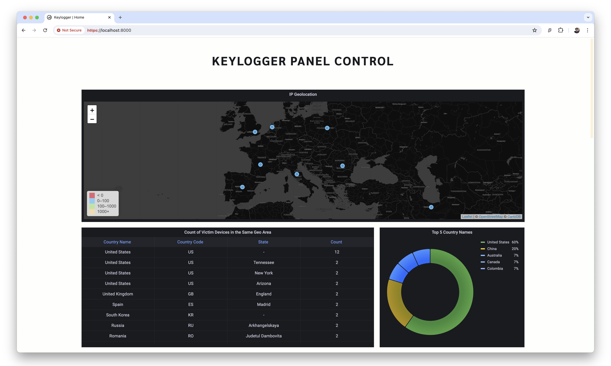

# Systems-Monitor-By-Keylogger

[](https://www.codefactor.io/repository/github/antonioscardace/systems-monitor-by-keylogger/overview/main)
[](https://github.com/antonioscardace/systems-monitor-by-keylogger/blob/master/LICENSE)
[](https://github.com/antonioscardace/systems-monitor-by-keylogger/issues)
[](https://github.com/antonioscardace/systems-monitor-by-keylogger/actions/workflows/ci-test.yml)

The project is the server system of a distributed keylogger. It aims to make real-time stats about systems where the keylogger is installed.
This keylogger may be a virus installed illegally or a service of the product legally accepted by the user. It is not relevant to this project.

The following functions are provided:
- Show the List of Active Devices :page_facing_up:
- Show Logs by the UUID of the Device :page_facing_up:
- Show Device Info by its UUID :page_facing_up:
- Stats (charts):
   + Victim devices geolocation by IP (multiple charts) :earth_americas:
   + Used apps classification (by basic heuristics) :bar_chart:
   + Top 15 most used applications :bar_chart:
   + Stats about time spent writing to the PC :eyes:
 
## Exam Goals

This project was created as an exam project to test a set of skills, including:
* Knowledge of Docker
* Knowledge of Data Streaming via Apache Kafka
* Knowledge of Data Processing via Spark Streaming
* Knowledge of Data Storing via ElasticSearch
* Knowledge of Data Visualization via Grafana

I also had the opportunity to practice the following skills:
* Knowledge of Java and Spring Boot
* Knowledge of the GitHub Actions
* Use of the Static Analysis Tools (CodeFactor, Snyk Code, and SonarQube)

## System Infrastructure

<p align="center">
   
</p>

- Each component used in this project is contained in a Docker Container. The UML of the internal structure of the server and its database are stored in [/docs/uml/](/docs/uml/).
- The keylogger must register the device during its first boot by sending an HTTP POST request to the server. Subsequently, it can send logs to the server via HTTP POST requests.
- For greater confidentiality and integrity, the value of each `key: value` pair in the JSON request body from the keylogger must be encrypted using **AES128 ECB (PKCS7 padding)** and encoded using **Base64**.

## GUI Demo




## Getting Started

So that the repository is successfully cloned and the project runs, there are a few prerequisites:

* A stable internet connection.
* Adequate free space, RAM, and CPU.
* Need to download and install [Docker](https://docs.docker.com/get-docker/).

Then, dependencies can be installed and the project can be run. 

```sh
   $ git clone https://github.com/antonioscardace/Systems-Monitor-By-Keylogger.git
   $ cd Systems-Monitor-By-Keylogger/
   $ bash run.sh
```

### Useful Links

| Container | URL | Description |
| --------- | --- | ----------- |
| user-interface | https://localhost:8000/ | Frontend (GUI) |
| grafana-charts | https://localhost:3000/d/jzqUXSSSz/systems-stats-by-keylogger | Grafana Dashboard |
| api-gateway | http://localhost:8888/ | API Gateway |
| kafka-ui | http://localhost:8080/ | GUI for Kafka |
